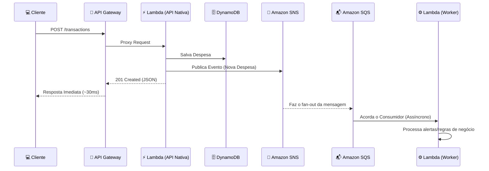

# ☁️ Cloud Budget Manager (Serverless API)


---

## 🚀 Destaques Técnicos

- **Zero Cold Start de Código:** Utilização do GraalVM para compilar a aplicação em uma imagem nativa Linux, reduzindo o tempo de inicialização e o tempo de execução da Lambda para **~30ms**
- **Eficiência de Custos:** A API roda perfeitamente no tier mais baixo de memória da AWS Lambda (**128 MB**)
- **Event-Driven:** Desacoplamento total do processamento de background utilizando mensageria (SNS/SQS)
- **Local Cloud Development:** Todo o ecossistema da AWS é emulado localmente via **LocalStack**

---

## 🛠️ Tecnologias Utilizadas

- **Backend:** Java 21, Quarkus (Amazon Lambda REST, DynamoDB, SNS, SQS)
- **Compilação Nativa:** GraalVM
- **Cloud & Serverless:** AWS API Gateway, AWS Lambda, DynamoDB, SNS, SQS
- **Infraestrutura e DevOps:** Terraform, Docker, LocalStack

---

## 📐 Arquitetura



---

## ⚙️ Como Executar o Projeto (Localmente)

### 📌 Pré-requisitos

- Docker Desktop rodando
- Terraform instalado
- JDK 21+ e Maven  
  *(ou GraalVM para build nativo)*

---

### ▶️ Passo a Passo

#### 1. Subir a Infraestrutura Base (LocalStack)

```bash
docker-compose up -d
```

#### 2. Compilar a Imagem Nativa

```bash
./mvnw clean package -Pnative "-Dquarkus.native.container-build=true"
```

#### 3. Deploy com Terraform

```bash
terraform init
terraform apply -auto-approve
```

#### 4. Testar a API

```bash
curl -X POST http://localhost:4566/_aws/execute-api/{API_ID}/dev/transactions \
     -H "Content-Type: application/json" \
     -d '{"amount": 150.00, "type": "EXPENSE", "categoryId": "cat-01"}'
```

---

## ✅ Resultado Esperado

- API respondendo localmente via API Gateway (LocalStack)
- Persistência no DynamoDB local
- Evento sendo publicado no SNS
- Processamento assíncrono via SQS + Lambda Worker  
